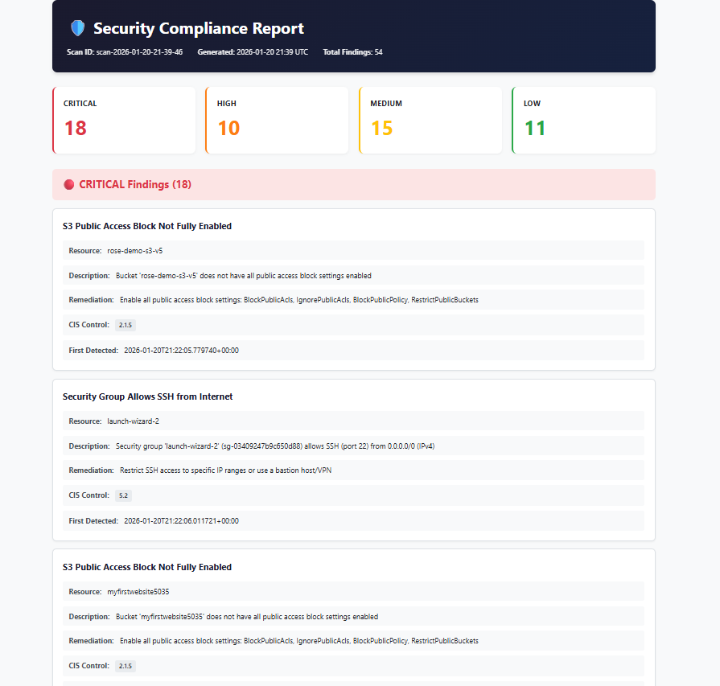

# 🛡️ CloudGuard - AWS Security Compliance Scanner

An automated serverless security compliance scanner that monitors AWS infrastructure for misconfigurations and compliance violations against the CIS AWS Foundations Benchmark.

## 📊 Sample Report


## 🎯 Features

- **Automated Daily Scans** - Runs automatically at 2 AM UTC via EventBridge
- **Multi-Service Coverage** - Scans S3, IAM, EC2, VPC, and CloudTrail
- **CIS Benchmark Aligned** - Maps findings to CIS AWS Foundations Benchmark controls
- **Severity Classification** - Categorizes findings as Critical, High, Medium, or Low
- **Professional Reports** - Generates HTML and JSON reports stored in S3
- **Real-Time Alerts** - Sends email notifications for critical findings via SNS
- **Infrastructure as Code** - Fully deployed using Terraform
- **Cost Effective** - Serverless architecture costs ~$3/month

## 🔍 Security Checks

| Service | Checks Performed |
|---------|------------------|
| **S3** | Public access blocks, encryption, versioning, logging, bucket policies |
| **IAM** | Root MFA, root access keys, password policy, unused credentials, admin privileges |
| **EC2** | Security groups (open ports), EBS encryption, IMDSv2, public instances |
| **VPC** | Flow logs, default security groups, NACLs, peering connections |
| **CloudTrail** | Enabled, multi-region, log validation, encryption |

## 🏗️ Architecture

```
┌─────────────────────────────────────────────────────────┐
│                    EventBridge                          │
│              (Daily at 2 AM UTC)                        │
└────────────────────┬────────────────────────────────────┘
                     │
                     ▼
┌─────────────────────────────────────────────────────────┐
│              Lambda: Orchestrator                       │
└────────────────────┬────────────────────────────────────┘
                     │
        ┌────────────┼────────────┬────────────┐
        ▼            ▼            ▼            ▼
   ┌────────┐  ┌────────┐  ┌────────┐  ┌────────┐
   │   S3   │  │  IAM   │  │  EC2   │  │  VPC   │ ...
   │ Check  │  │ Check  │  │ Check  │  │ Check  │
   └────┬───┘  └────┬───┘  └────┬───┘  └────┬───┘
        │           │           │           │
        └───────────┴─────┬─────┴───────────┘
                          ▼
              ┌───────────────────┐
              │     DynamoDB      │
              │   (Findings)      │
              └─────────┬─────────┘
                        │
                        ▼
              ┌───────────────────┐
              │ Report Generator  │
              └─────────┬─────────┘
                        │
           ┌────────────┼────────────┐
           ▼            ▼            ▼
      ┌────────┐   ┌────────┐   ┌────────┐
      │   S3   │   │  SNS   │   │ Email  │
      │ Report │   │ Alert  │   │        │
      └────────┘   └────────┘   └────────┘
```

## 📋 Prerequisites

- AWS CLI configured with appropriate credentials
- Terraform >= 1.0
- An AWS account with permissions to create Lambda, DynamoDB, S3, SNS, and EventBridge resources

## 🚀 Deployment

1. **Clone the repository**
   ```bash
   git clone https://github.com/Huirui88/cloudguard-aws-security-scanner.git
   cd cloudguard-aws-security-scanner/compliance-scanner/terraform
   ```

2. **Configure variables**
   ```bash
   cp terraform.tfvars.example terraform.tfvars
   ```
   
   Edit `terraform.tfvars`:
   ```hcl
   aws_region  = "us-east-1"
   environment = "dev"
   alert_email = "your@email.com"
   ```

3. **Deploy**
   ```bash
   terraform init
   terraform apply
   ```

4. **Confirm SNS subscription** - Check your email and click the confirmation link

## 🧪 Testing

Manually trigger a scan:

```bash
aws lambda invoke \
  --function-name compliance-scanner-orchestrator-<suffix> \
  --invocation-type Event \
  response.json
```

View reports:
```bash
aws s3 ls s3://compliance-scanner-reports-<suffix>/reports/ --recursive
```

## 📸 Screenshots

### Dashboard


### Critical Findings


### Email Alert


## 💰 Cost Estimate

| Service | Monthly Cost |
|---------|--------------|
| Lambda | ~$0.50 |
| DynamoDB | ~$2.00 |
| S3 | ~$0.50 |
| SNS | ~$0.10 |
| **Total** | **~$3.10** |

## 🗑️ Cleanup

To remove all resources:

```bash
cd terraform
terraform destroy
```

## 📚 CIS AWS Foundations Benchmark

This scanner maps findings to [CIS AWS Foundations Benchmark v1.5.0](https://www.cisecurity.org/benchmark/amazon_web_services) controls. See [docs/CIS_MAPPING.md](docs/CIS_MAPPING.md) for the complete mapping.

## 📄 License

MIT License - feel free to use this project for your own learning and security monitoring.

## 🙏 Acknowledgments

Built with assistance from [Claude AI](https://claude.ai) by Anthropic.
